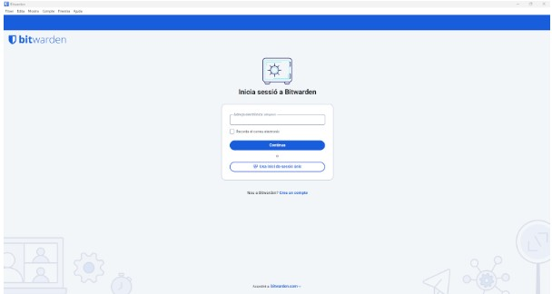
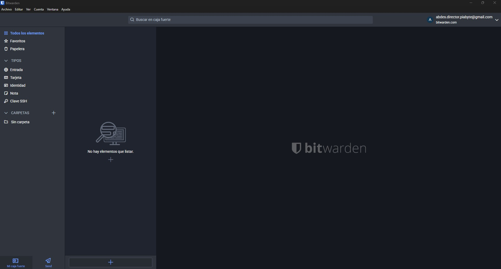
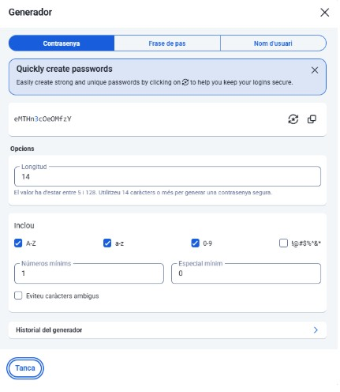
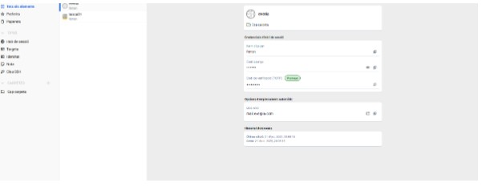
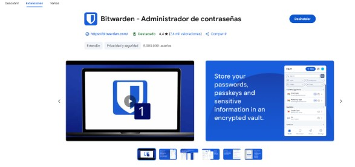

1. Instal·lació i Configuració Inicial: Descàrrega, instal·lació i creació de la BBDD principal o compte mestre.

Primer ens hem de descarregar el bitwarden i un cop descarregada iniciem sessió.

Un cop iniciem sessió al bitwarden hem de començar la generació de contrasenyes.

2. Generació de Contrasenyes Segures: Explicació de com utilitzar el generador de contrasenyes de l'eina (paràmetres, longitud, caràcters especials).

El generador et deixa seleccionar la longitud i afegir símbols, xifres i lletres majúscules per fer-la més segura. Ajusta les opcions segons el que necessitis i prem generar: obtindràs una contrasenya robusta i aleatòria.

3. Exemples d'Ús i Emplenament Automàtic:

Com desar una credencial d'un compte de correu electrònic.

Com desar una credencial d'una aplicació o servei web.

Com fer servir l’extensió del navegador per emplenar automàticament les dades.

He hagut de buscar al chrome l'extensió del bitwarden i afegir-la al google chrome per poder fer aquest pas. 

