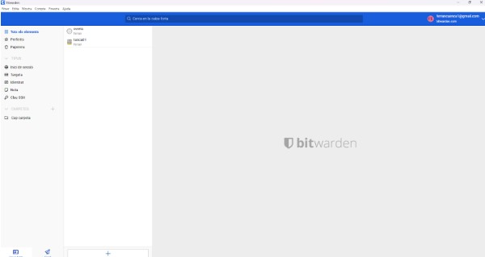
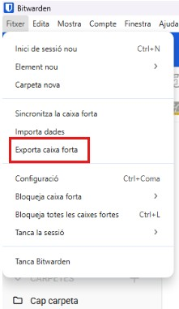
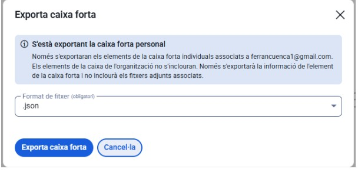
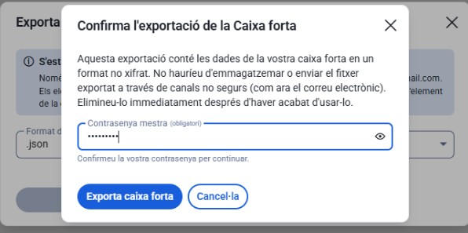
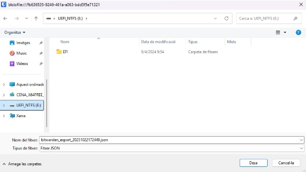

🛡️ T01: Guia d’Implementació de Bitwarden — Gestor de Contrasenyes Segur

1. Instal·lació i Configuració Inicial: Descàrrega, instal·lació i creació de la BBDD principal o compte mestre.

Primer ens hem de descarregar el bitwarden i un cop descarregada iniciem sessió.

Un cop iniciem sessió al bitwarden hem de començar la generació de contrasenyes.

2. Generació de Contrasenyes Segures: Explicació de com utilitzar el generador de contrasenyes de l'eina (paràmetres, longitud, caràcters especials).

El generador et deixa seleccionar la longitud i afegir símbols, xifres i lletres majúscules per fer-la més segura. Ajusta les opcions segons el que necessitis i prem generar: obtindràs una contrasenya robusta i aleatòria.

3. Exemples d'Ús i Emplenament Automàtic:

Com desar una credencial d'un compte de correu electrònic.

Clica el botó “+” per afegir una nova entrada.

Selecciona l’opció “Inici de sessió”.

Introdueix la informació del compte (usuari, contrasenya, URL, etc.) als camps requerits.

Desa la credencial per guardar-la de forma segura.

Com desar una credencial d'una aplicació o servei web.

Una vegada complerts tots els apartats cliquem a guardar i ja tindrem la nostre credencial d'un compte de correu.

He hagut de buscar al chrome l'extensió del bitwarden i afegir-la al google chrome per poder fer aquest pas. 

Gestió de Còpies de Seguretat (Backup):

Explicació detallada de com fer una còpia de seguretat de l'arxiu de contrasenyes (KDBX en KeePass o Exportació en Bitwarden).

Gestió de Còpies de Seguretat (Backup):

Explicació detallada de com fer una còpia de seguretat de l'arxiu de contrasenyes (KDBX en KeePass o Exportació en Bitwarden).

Recomanació de la millor pràctica per emmagatzemar aquesta còpia de seguretat de forma segura (clau USB xifrada o emmagatzematge xifrat al núvol).

Li donem a fitxer adalt a l’esquerra i exportem la caixa forta del bitwarden. 

Un cop dintre per exportar la caixa forta posem el nostre correu i exportem la caixa forta.

posem una contrasenya robusta, i confirmem l’exportació 

I ens descarreguem al pen tot el treball de bitwarden i tota l'instl·lació. 

