# T04 serveis directori LDAP

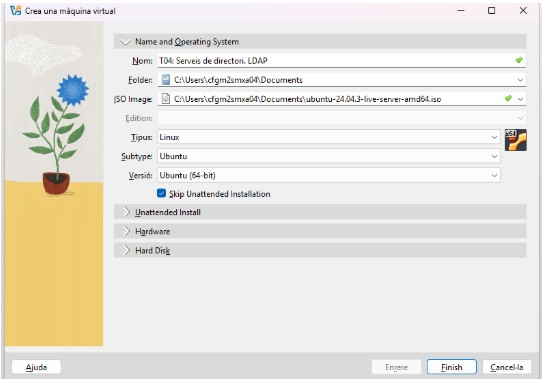

 He hagut de crear els parametres de la màquina desde fora per poder fer la activitat tal i com pertoca.

 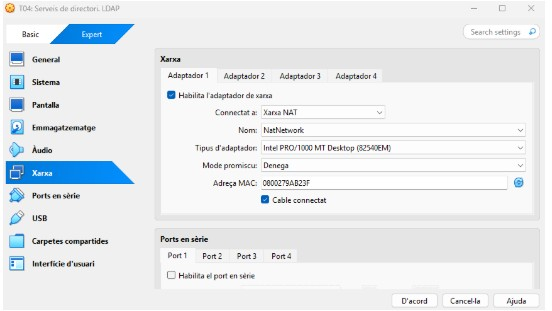

 A continuació posarem un adaptador en “xarxa NAT” 

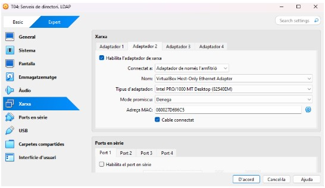

I el segon adaptador en amfitrió. 

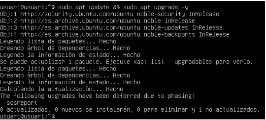

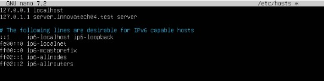

Aqui hem hagut de posar el nostre domini que en al meu cas es: “server.innovatech04.test server”

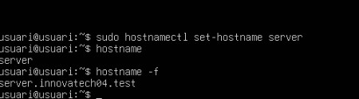

Ara amb la comanda “sudo hostnamectl set-hostname server” i despres un “hostname” i un “hostname -f” podem veure si ho hem fet be com s’ens a canviat al domini correctament.

Posan aquesta comanda entrem a la configuració de la màquina. 

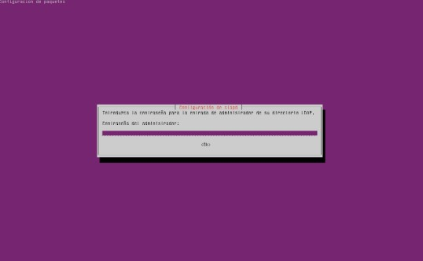

Com a contrasenya posarem usuari i aixi evitarem no oblidar-la.

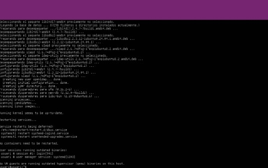

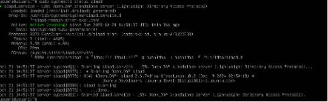

Farem una comanda “sudo systemctl status slapd” per veure l’estat ldap que si et surt enable ja esta perfectament l’estat.

Farem un “sudo dpkg-reconfigure slapd” per entrar a la configuracio del ldap. 

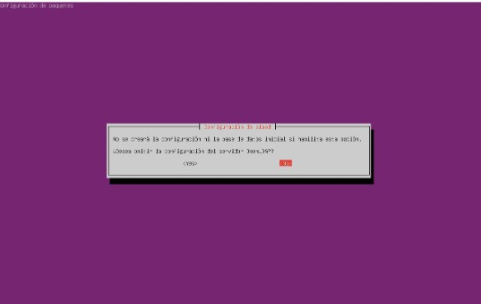

la primera opció posarem que no perque aixi no cancel·lem la configuració de la BDD atés que es al que volem fer.

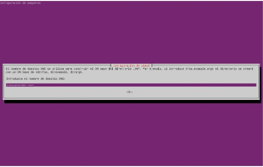

Posem al nom corresponent que en el meu cas es innovatech04.test

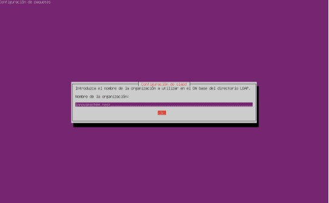

posem el nom de l’organització que es innovatech04.test

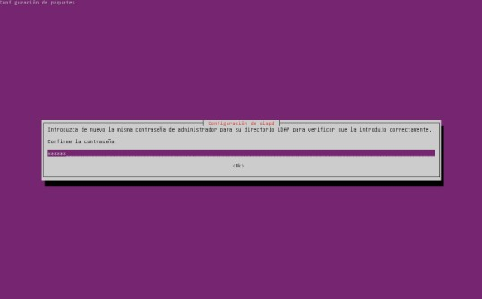

I li posem la contrasenya que ens demana la tasca que es “p@ssw0rd”

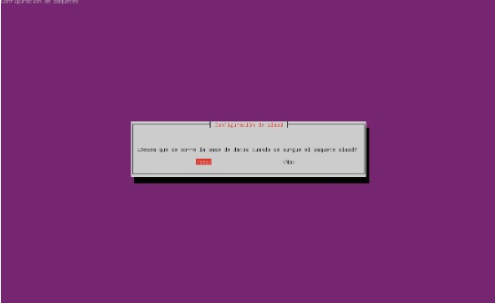

indiquem que quan s’elimini el paquet, també s’esborri la BD creada 

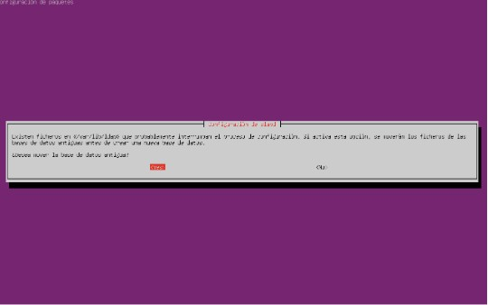

I li diem que mogui la informació del directori existent a una carpeta de backup.

Aquesta comanda és per entrar a la configuració.

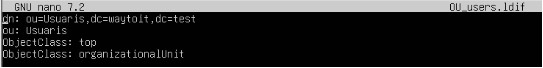

Amb la comanda “sudo nano OU_users.ldif” entre a aquesta configuració on manualment hem hagut de canviar al dn,al ou, posar ObjectClass: Top i ObjectClass: organizationUnit.

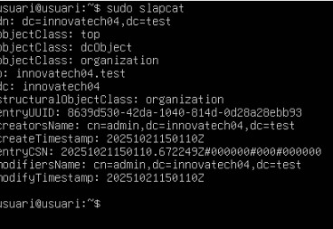

Amb la comanda “sudo slapcat” podem comprovar si hem configurat be la configuració i si et surt correctament tot. 

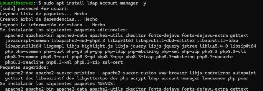

Amb la comanda “sudo apt install ldap-account-manager -y instalarem ldap 

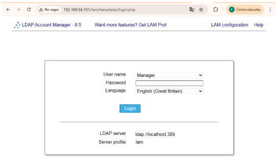

Un cop instalas al ldap, vas al navegador posas la teva ip i t’entrarà aquesta part de la tasca on has de posar una password. 

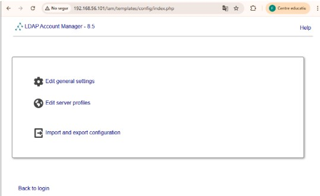

Seguidament et surtiràn tres opcions li clicarem la opció del mitj que es “edit server profiles”

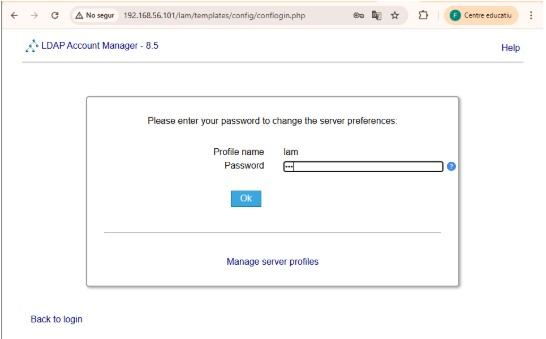

Seguidament veuras al profile name que s’anomena lam i li posas una contrasenya que t’enrecordis la que he posat jo es “lam”

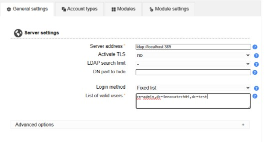

Un cop possas la contrasenya podras veure totes las configuracions i hem de canviar algunes coses. Las parts que hem de canviar en server settings hem de canviar la part de “list of valid users” que hem de posar el nostre cn=admin, el nostre dc=innovatech04 i el nostre dc=test

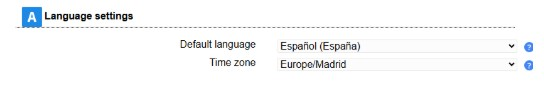

Canviem el llenguatge que el posarem en espanyol.

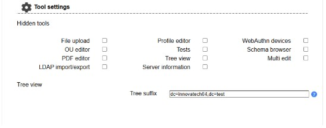

I a tools settings hem de canviar al “tree view” que hem de posar el nostre dc=innovatech04 i el nostre dc=test.

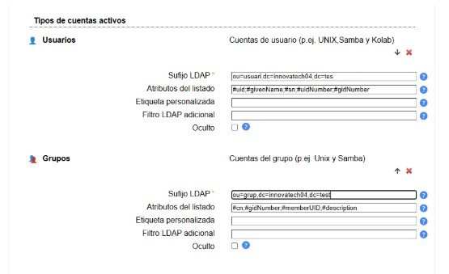

Aqui els tipos de cuentas activas, hem de posar el nostre sufijo LDAP que seria ou=usuari,dc=innovatech04,dc=test

I a la part de grups,ou=grup,dc=innovatech04,dc=test

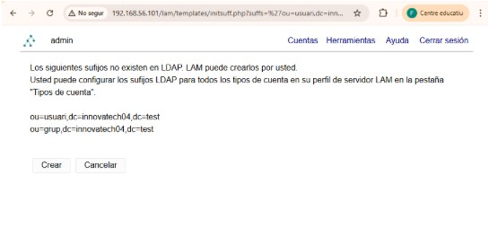

un cop li donem a save a las configuracions ens demana iniciar sessió, iniciem sessió i et sortirà aquest apartat. Per beure que has canviat correctament els usuaris i els grups. 

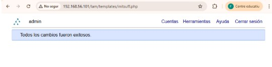

com podem veure amb aquesta captura tots els canvis s’han executat correctament. 

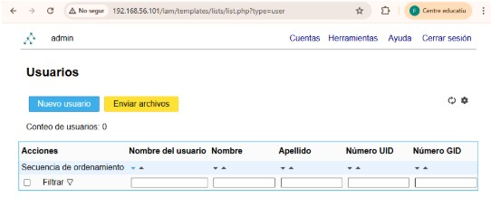

Ara un cop aqui dintre crearem primer els nous grups. 

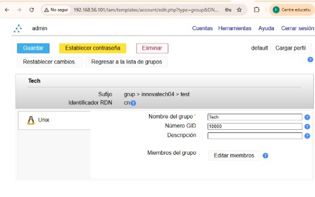

Al nom del primer grup li posarem tech i al numero del GID 10000. I guardem el grup 

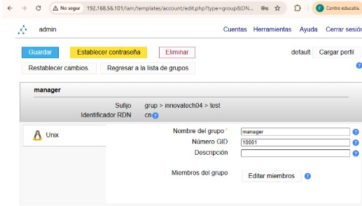

I al segon grup ha de dir-se manager i el número GID 10001 i amb al maager i al tech ja tindrem els dos grups que ens demanar creats. 

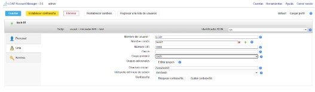

Un cop creat els grups hem de crear dos usuaris al primer usuari anomenat tech01 i li posem una contrasenya. Sobretot el usuari tech s’ha de posar en el grup que vam crear anomenat tech01. 

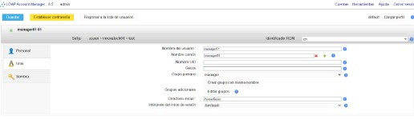

I al segon usuari anomenat manager01 i li posem una contrasenya i ja tindrem els dos usuaris sobretot el usuari manager s’ha de posar en el grup creat anteriorment que es al de manager.

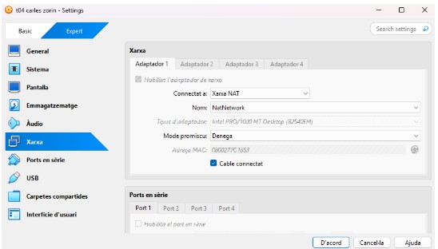

Crearem una màquina zorin per conectar al servidor amb el client i que es puguin connectar. 

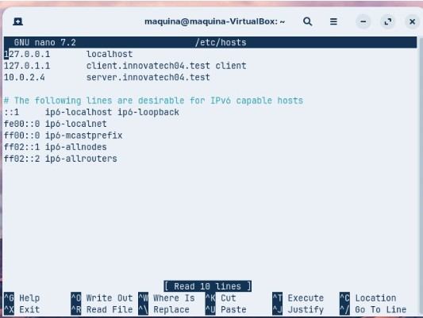

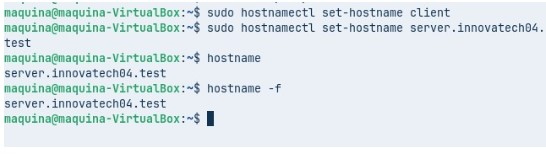

guardem la configuració, i a la terminal fem un 
sudo hostnamectl set-hostname client 
sudo hostnamectl set-hostname server.innovatech04.test
hostname (que si esta be et sortirà al domini)
hostname -f 

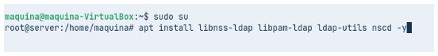

farem un sudo su per entrar al root i fem la comanda dins de la ruta root “apt install libnss-ldap libpam-ldap ldap-utils nscd -y”

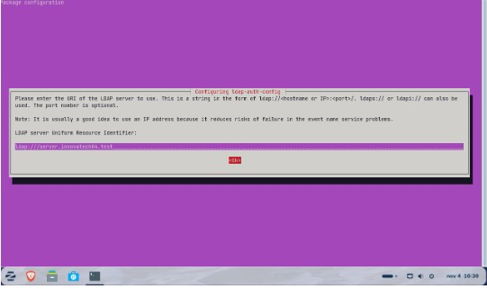

Un cop estem aqui dintre posem: ldap:///server.innovatech04.test

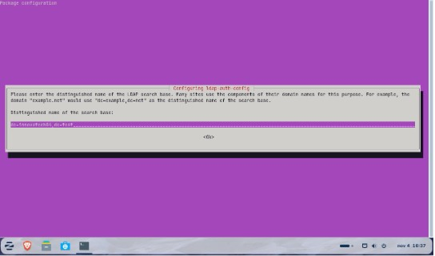

Seguidament posem: dc=innovatech04,dc=test

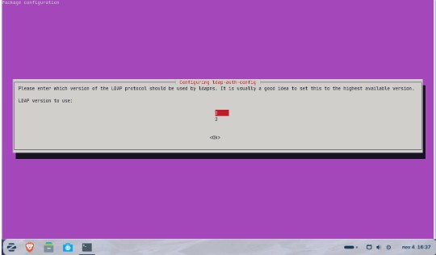

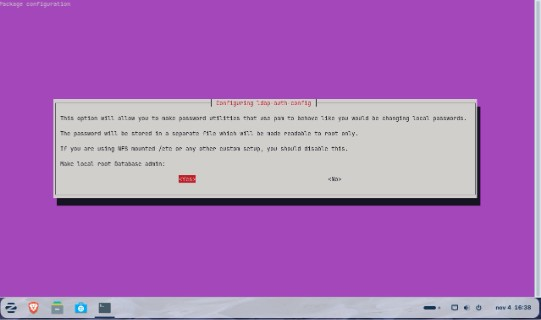

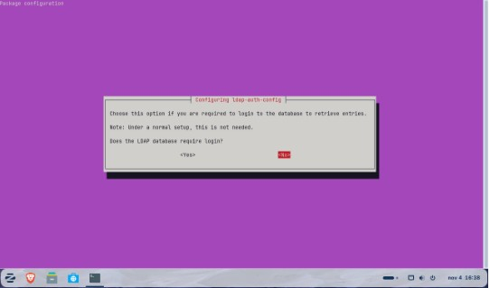

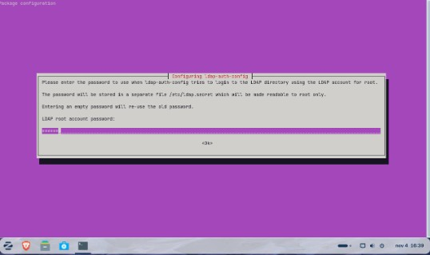

Aqui posem: cn=admin,dc=innovatech04,dc=test

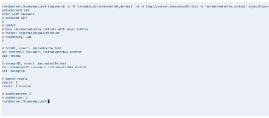

I posem una contrasenya.

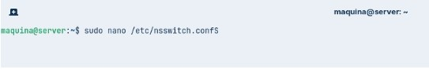

Posem aquesta comanda i sobretot sha de posar la contrasenya que vam posar a la primera màquina que era: p@ssw0rd.

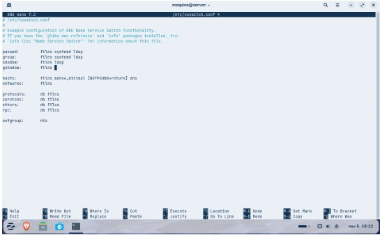

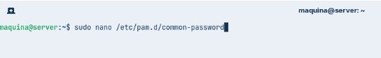

Amb la comanda “sudo nano /etc/nsswitch.conf” entre a la configuració i hem de editar al passwd al group al shadow i gshadow posan ldap a totas las parts menys a la gshadow que es queda al files sol. 

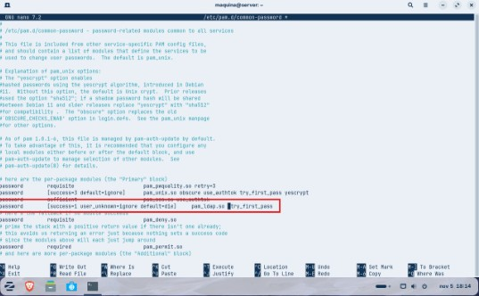

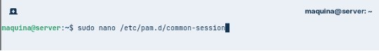

Seguidament posem la comanda “sudo nano /etc/pam.d/common-password” On he marcat he hagut de eliminar la linia el terme “use_authtok”.

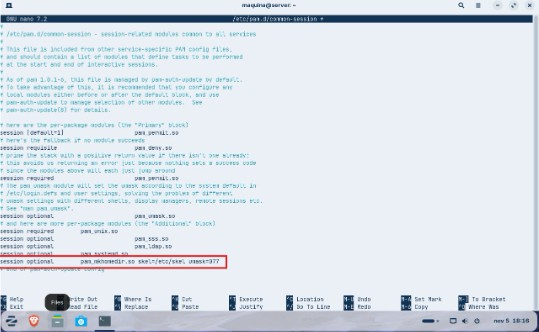

Aquesta configuració entrem amb la comanda “ sudo nano /etc/pam.d/common-session” i on està en vermell hem hagut d'afegir la línia indicada per crear els perfils. 

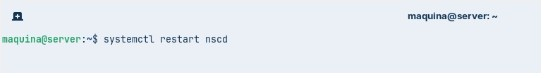

Fem aquesta comanda per reinicia al servei.

Et demana la contrasenya de la màquina client la posas i ja hauràs reiniciat al servei. Es tech01 l'usuari i la contrasenya vaig posar 1234.

Seguidament amb la comanda “getent passwd | tail” veiem els usuaris LDAP.

Quan entrem a la configuració, posem:

auth sufficient pam_ldap.so
auth requisite pam_nslogin.so
i afegim una: auth required pam_permit.so

Un cop tot reboot a la màquina. 

I aqui podem entrar amb la màquina client, amb el tech01 i amb el manager01

