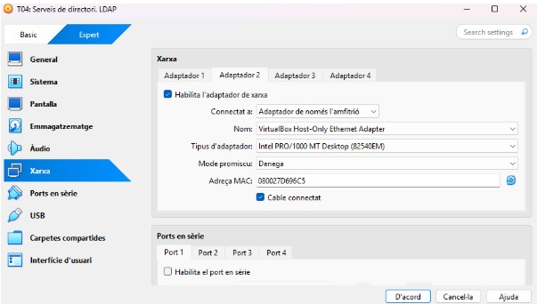
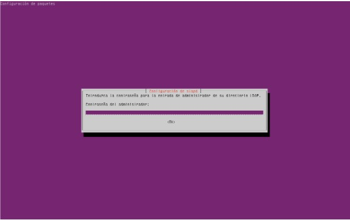

T04 serveis directori LDAP

He hagut de crear els parametres de la màquina desde fora per poder fer la activitat tal i com pertoca.

A continuació posarem un adaptador en “xarxa NAT” 

I el segon adaptador en amfitrió. 

Aqui hem hagut de posar el nostre domini que en al meu cas es: “server.innovatech04.test server”

Ara amb la comanda “sudo hostnamectl set-hostname server” i despres un “hostname” i un “hostname -f” podem veure si ho hem fet be com s’ens a canviat al domini correctament.

Posan aquesta comanda entrem a la configuració de la màquina. 

Com a contrasenya posarem usuari i aixi evitarem no oblidar-la.

Farem una comanda “sudo systemctl status slapd” per veure l’estat ldap que si et surt enable ja esta perfectament l’estat.

Farem un “sudo dpkg-reconfigure slapd” per entrar a la configuracio del ldap. 

la primera opció posarem que no perque aixi no cancel·lem la configuració de la BDD atés que es al que volem fer.

Posem al nom corresponent que en el meu cas es innovatech04.test

posem el nom de l’organització que es innovatech04.test

I li posem la contrasenya que ens demana la tasca que es “p@ssw0rd”

indiquem que quan s’elimini el paquet, també s’esborri la BD creada 

