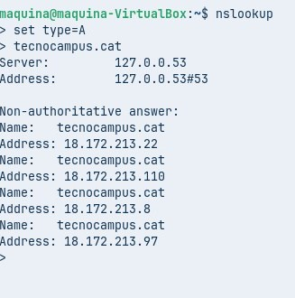

T06: Fonaments del servei DNS

Per començar obrim la terminal, i posem la comanda “dig xtec.cat A” per consultar el registre DNS de tipus A del domini xtec.cat. 

Farem la comanda “ dig tecnocampus.cat NS” per treballar en un entorn de proves segur i aïllat, on es poden fer pràctiques o comprovacions de xarxa (com consultes DNS) sense afectar el sistema real.

farem comanda “ dig escolapia.cat SOA” Per realitzar proves i pràctiques de xarxa en un entorn segur i aïllat, on es poden consultar registres DNS (com el SOA) sense afectar el sistema real.

Farem la comanda “dig -x 147.82.2.135” busca quin nom de domini (hostname) està associat a una adreça IP determinada (en aquest cas,14.82.2.135).

Aquesta comanda serveix per fer una consulta DNS directa per obtenir les adreces IP associades a un nom de domini (en aquest cas, tecnocampus.cat).

farem comanda “nslookup” i posarem set 
type=NS 
Tecnocampus.cat 

per veure els name server dels ns.

mostra informació del servidor DNS per defecte que està utilitzant el teu ordinador o xarxa.

mostra una altra consulta feta amb el comandament nslookup, i en aquest cas s’està consultant el registre A del domini tecnocampus.cat.
